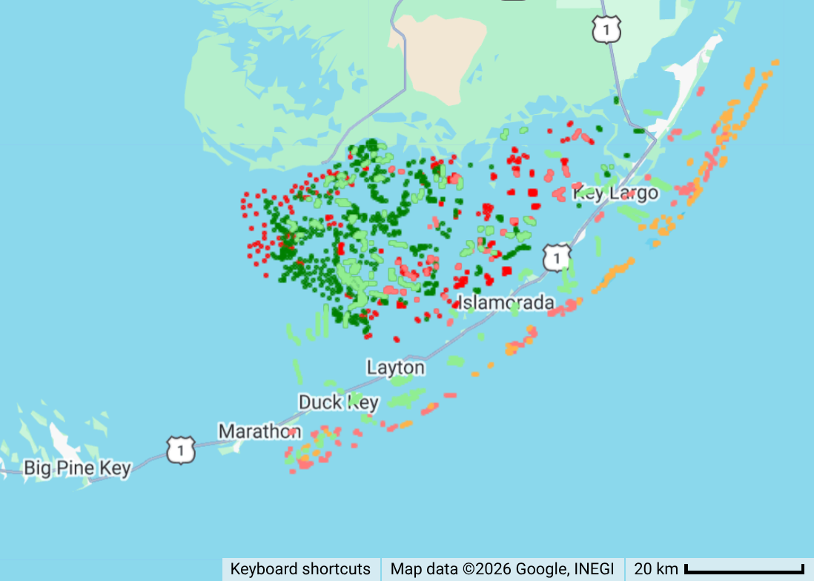
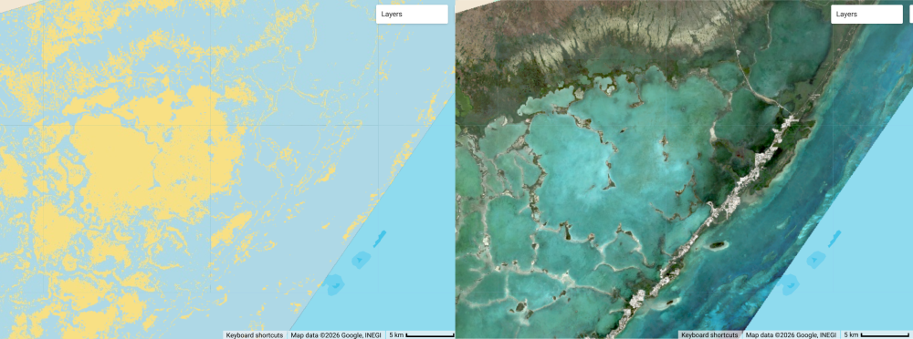
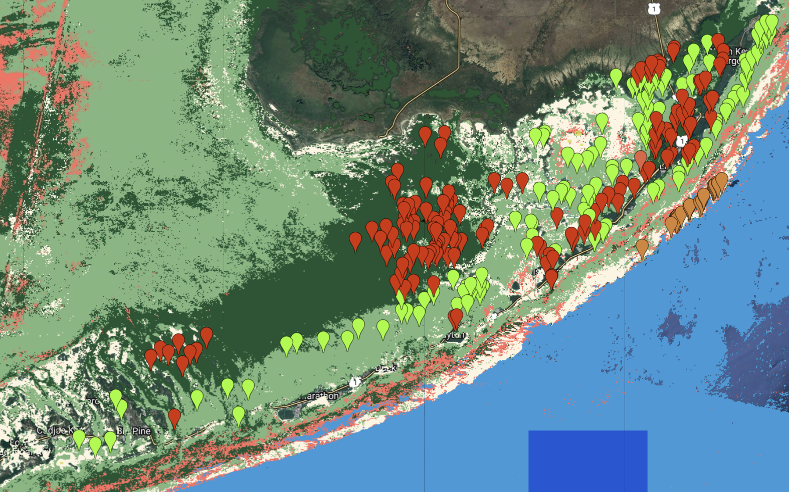
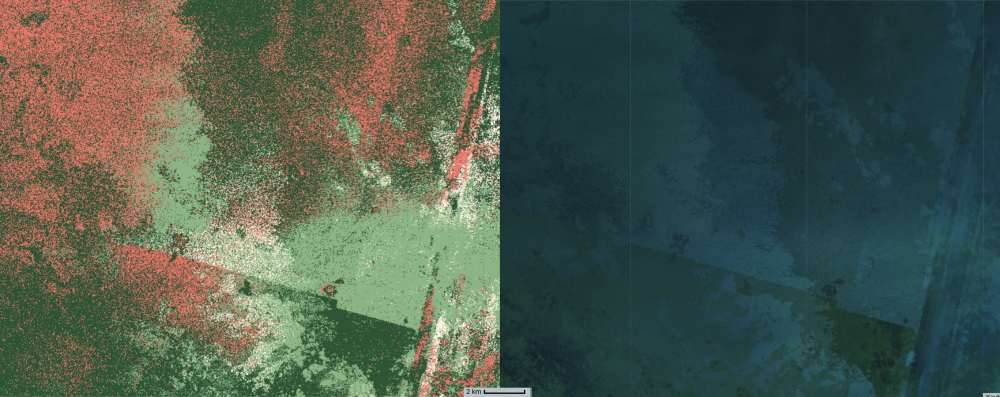

An attempt was made to map seagrasses in the Florida Keys region.

## Methods
### Ground Truth Data
#### Lizcano 2019 and 2021
Ground truth data was ingested from the works of Luis Lizcano [^1].


**Ground truth data used for the Florida Keys region. Two data collections are displayed; one from 2019 and the other from 2021.The 2019 data is shown in lighter colors than the darker 2021 data. Classes are displayed are: seagrass in green, softbottom in red, and hardbottom (corals) in orange. Source code [here](https://code.earthengine.google.com/?scriptPath=users%2Ftylarmurray%2Ffknms%3Aseagrass_ground_truth_lizcano).**


#### FK2025-Visual Ground Truth
Additional ground truth data was created using visual interpretation of S2 imagery from 2025 and the 2026 google maps satellite view.
This visual interpretation was guided by the ground truth data of Lizcano to create a ground truth dataset with an increased diversity of classes.
This dataset separates "dense" submerged aquatic vegetation from "sparse" submerged aquatic vegetation.
The visual differences between dense and sparse seagrass are significant, and initial tests suggested that segmentation into these subclasses would improve classification accuracy.


### Image Selection
Images from the landsat-harmonized sentinel 2 collection on GEE were used.


### Image Pre-processing
Clouds were filtered from the images using the CloudScore+ product published on GEE.
The band values are scaled using the sat_fns:s2_fns.scaleBands method, which implements:

```javascript
  var scaledImg = img.select(exports.rrs_bands)
    .divide(10000).divide(3.1415926)
  ;
```

Land masking was applied using an NDWI calculation.

A depth-invariant index was applied using statistics calculated from sand polygons across multiple depths.

## Results
### Lizcano-trained products
The first attempt at classification used minimal pre-processing (only cloud filter and scaling) and the Lizcano ground truth data.
This classification resulted in an image with no seagrass.

For the second result, the same experiment was run with extraneous S2 bands in the dataset removed; only the spectral bands were kept.
The result was much better, indicating that inclusion of the extra bands were confusing the classifier.




### FK2025-Visual-trained products

* [script used](https://code.earthengine.google.com/fc18cf1a3ed97e7593681e0f7b73a0ea)


**Classification and ground truth data for training on the FK2025-Visual data.**

A clear issue with this product can be seen in the top-left of the view, where much of the area appears to be classified as coral.
A closer view of this area reveals additional characteristics of this issue.


**Zoomed in view of top-left region with classification inaccuracies. Classification results (left) are very speckled and show features characteristic of image artifacts. S2 mean for the time range shows artifacts from mosaicing and cloud masking.**

One potential cause could be poor image coverage of this area, resulting in a poor quality mean image.
This could be explored further by mapping the image count per pixel.

Another explaination that accounts for the speckled texture is that this area is highly impacted by sunglint.
Sunglint removal processing could reduce this misclassification.

Additional ground truth points could be used in this area, but I am uncertain what the true class of this region should be.
The spectral signature appears different from the deep-water areas past the reef tract.
I do not know what the depth in this region is.

## Next Steps 

Next steps might include:


1. sunglint correction
2. addition of texture 'bands'
3. addition of a bathymetric 'band'
4. implement bandSum-normalization


## References
[^1] Seagrass Extent Expansion in the Gulf of Mexico and Northwestern Caribbean (1987–2021) Luis Lizcano-Sandoval, Susan Bell, Sergio Cerdeira-Estrada, Beatriz Martinez-Daranas, Enrique Montes, Brigitta van Tussenbroek, Frank Muller-Karger bioRxiv 2025.11.10.687714; doi: https://doi.org/10.1101/2025.11.10.687714
