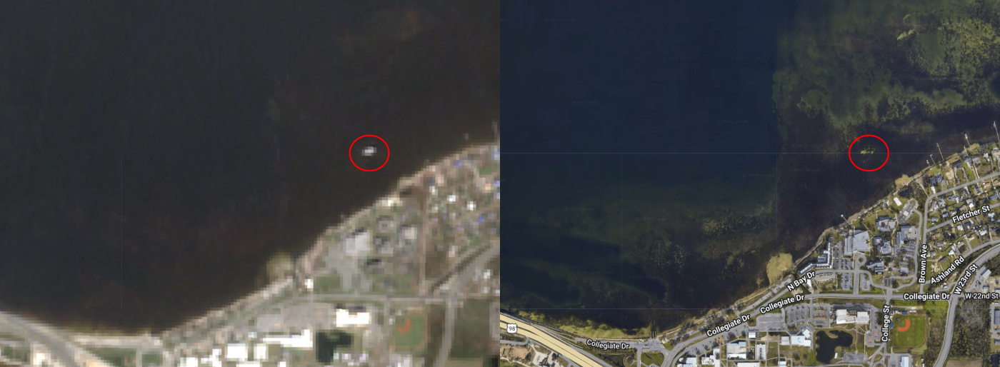
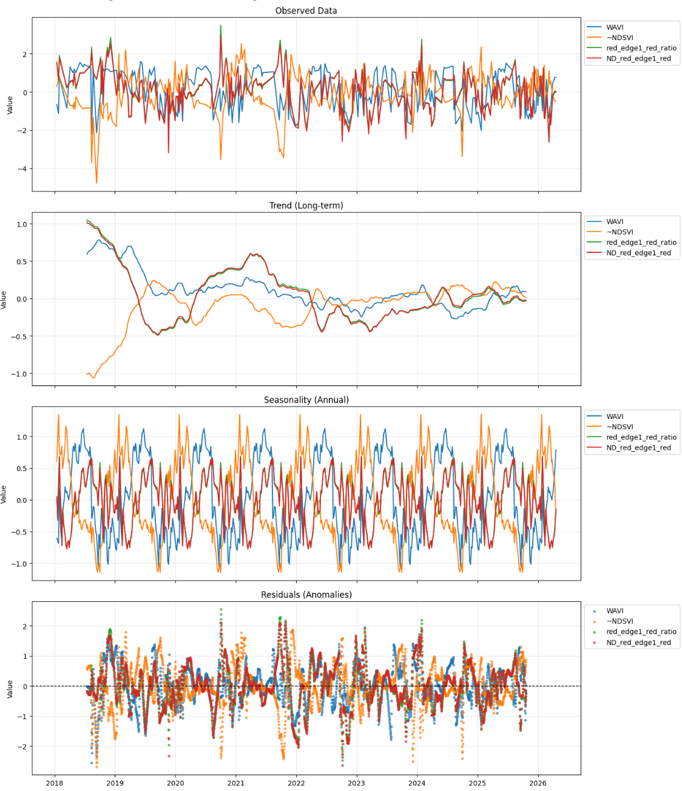
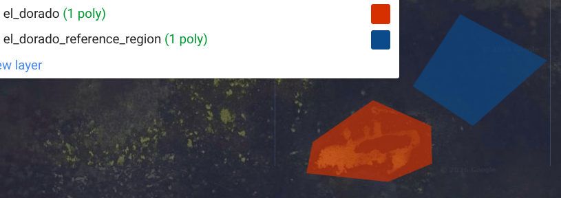
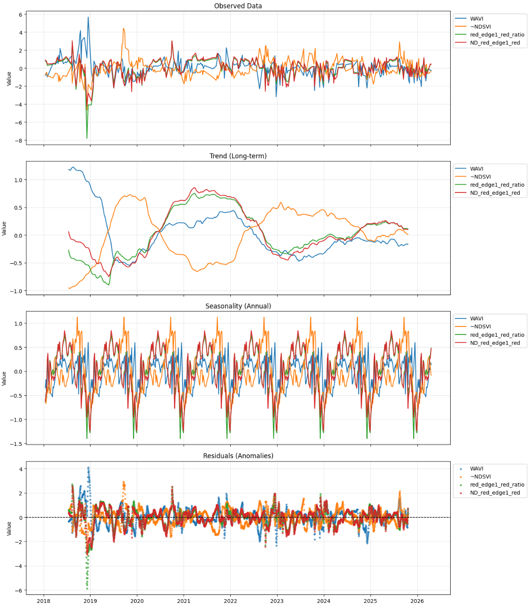

The 147-foot commercial vessel El Dorado ran aground in North Bay, St. Andrew Bay, FL, following Hurricane Michael 2018-10-10, settling in 2-3 feet of water on a seagrass bed near Carl Grey Park and the Hathaway Bridge.
Salvage work continued through 2019-03-03.

----------------------------------------------------

A cloud-masked median of Sentinel-2 imagery was composited for the duration of the vessel's grounding.

The image on the left is Sentinel-2 averaged over the El Dorado's grounding (2018-10-10 to 2019-03-03). The circled object is assumed to be the El Dorado.
On the right is google earth's imagery from 2026-04, and it appears a scar is still there. 

----------------------------------------------------

A polygon around the El Dorado was hand-drawn and a time series was extracted from the region using [this GEE script](https://code.earthengine.google.com/dee4c91ef954cd41d308f906b5b946d6).
626 images from the 2018-01-01 to 2025-04-21 time range were used in the extraction.
From the extracted spectral bands, four seagrass indices were calculated.
A seasonal decomposition was applied to the resulting time series.

The seasonality for the four indices do not align well. 
~NDSVI seasonality peaks in the winter, and the other three peak in the summer. 
The WAVI seasonality peaks earlier in the summer than the two red-to-red-edge differences.

The trends show an event from late 2018 through mid-2019.
This is the grounded El Dorado's bright signal.

----------------------------------------------------

A "reference region" was established near the El Dorado.

This region was subtracted from the "El Dorado" AoI to remove any potential regional image clarity issues.
A seasonal decomposition was run on the z-scores of the resulting differences.

The seasonality of all four indices is well aligned, with a peak in the summer.
The El Dorado grounding event is visible in the trend of the WAVI.
For the other three indices, the El Dorado grounding event peaks are less apparent.
In the residuals, the WAVI and red_edge1_red_ratio show peaks during the El Dorado Grounding.