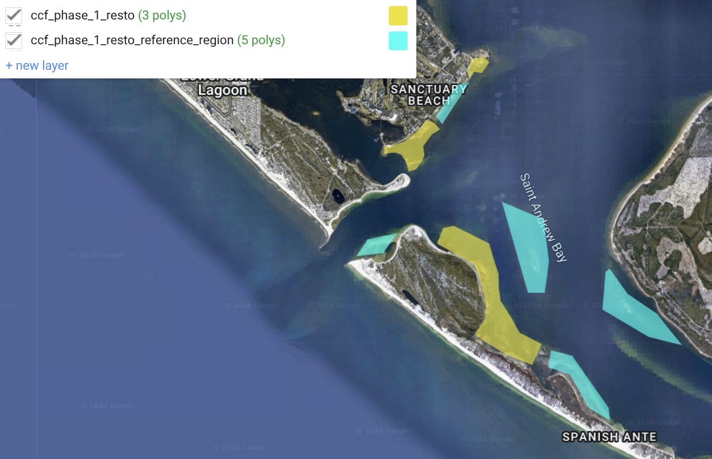
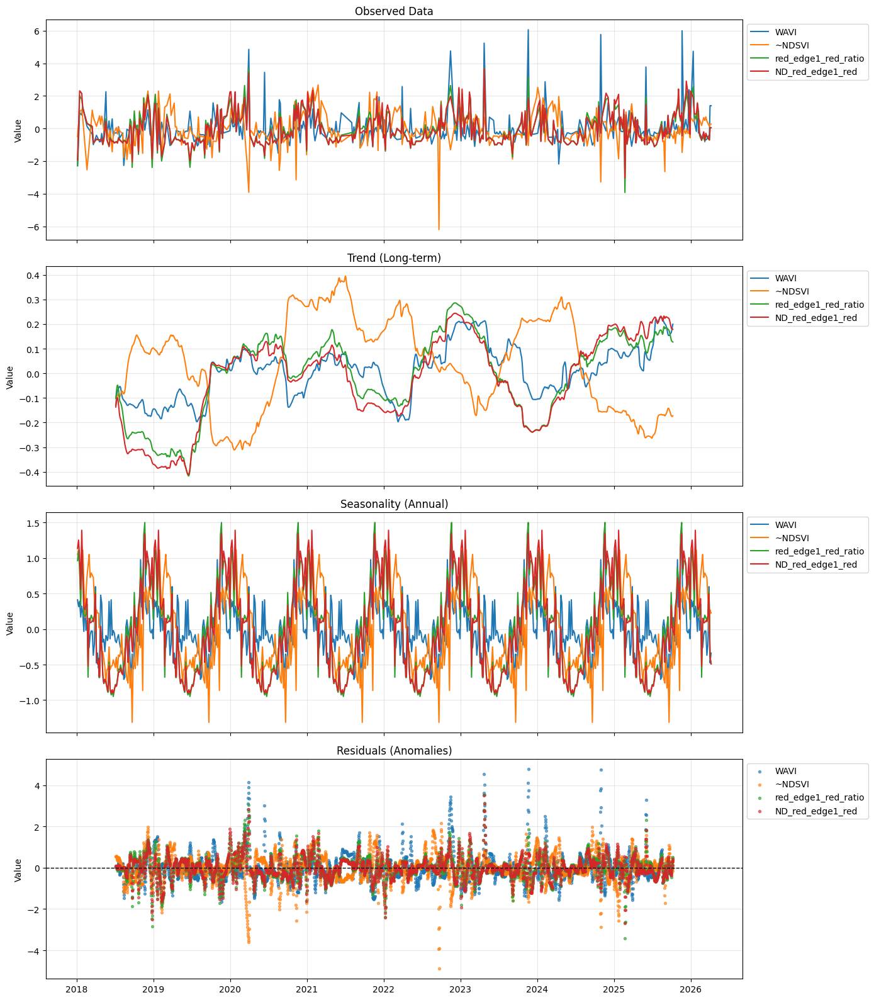
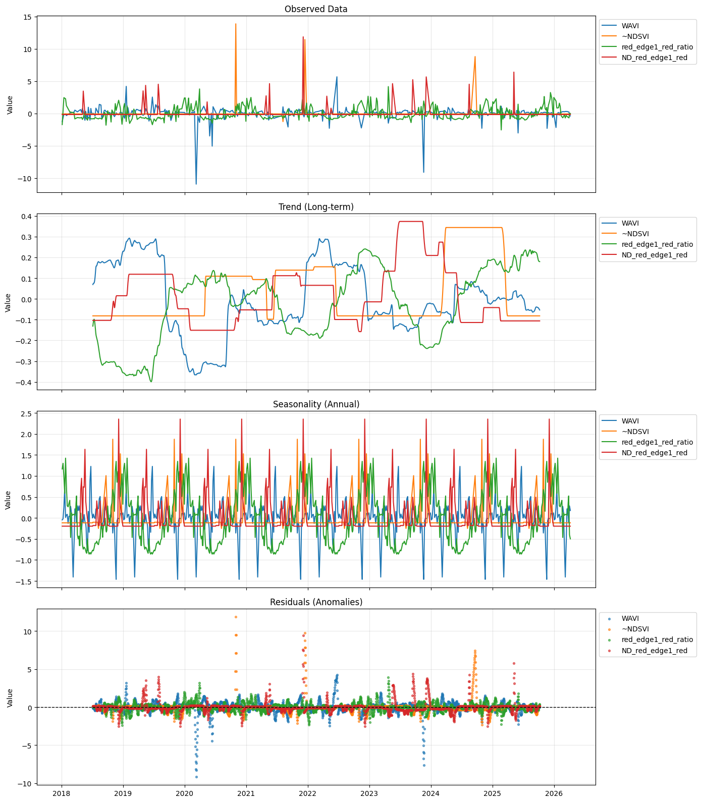

An attempt was made to detect changes in spectral signals due to prop scarring and restoration efforts.

* [GEE Script](https://code.earthengine.google.com/?scriptPath=users%2Ftylarmurray%2Fst-andrews-bay%3Aseagrass_time_series_extraction)
* [colab notebook](https://colab.research.google.com/drive/1b0n4yCncdD2ta9RMdo5JHPOp7-d16VJG?usp=sharing)

## Area of Interest
A polygon for the Area of Interest (AoI) were hand-drawn to approximate polygons identified in the "CCA24 Phase 1 Installation Map Package_Nov2025.pdf" document [[ref email for Tylar only](https://mail.google.com/mail/u/0/#inbox/QgrcJHrtvXGVDzJrWNBtpcnWhKQkmNhFSbq?compose=GTvVlcSPFdFRvFsCtsrSZmGTCvmQxxlMspnpxHXVPZXzFpbLFbzWkCkpQjXJpVwZVfPqzJgVmCVjs)].

A "reference region" of nearby area with similar optical characteristics was drawn.

## Imagery, PreProcessing, Time Series Extraction
Landsat-Harmonized Sentinel-2 imagery was sampled across these polygons using [this GEE script](https://code.earthengine.google.com/0fc75bdfecb0c44daf61c73419c64bac).

CloudScore+ cloud filtering was applied.
BandSum normalization was performed using the sum of all bands except for band 9.

The resulting time series data were uploaded to [github/7yl4r/HabEvent/aoi-extractions](https://github.com/7yl4r/HabEvent/tree/main/aoi-extractions).

## Indices
Four spectral indices are calculated from the raw band values to target seagrass.

1. WAVI: `(B8-B2)/(B8+B2)`
2. inverse NDSVI (~NDSVI) `(B3-B2)/(B3+B2)`
3. red_edge1/red `B5/B4`
4. Normalized Difference red_edge1-red `(B5-B4)/(B5+B4)`

## Seasonal Decomposition, Reference Region Adjustment, & Results
A seasonal decomposition with an additive model was applied to separate the seasonal signal from long term trends and residuals.

The reference region is used as a baseline against which to compare the AoI.
This can be done with a subtraction or a division operation.

The resulting differenced values are converted to z-scores for display on a common y-axis.

### Subtraction

A sine-shaped seasonal signal is observed in each of the indices.
Long-term trends for WAVI, red_edge1_red_ratio, and ND_red_edge1_red follow each other closely.

### Division

The expected sine-wave-shaped seasonal signal is apparent in the red_edge1_red_ratio index.
The other three indices have less well-defined seasonal signals.

Spikes in the residuals are observed; these may be the result of divide-by-almost-zero when the reference region has very low values.
